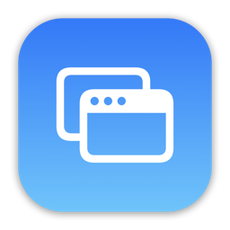

# SpaceSaver
SpaceSaver is a macOS application designed to help you manage your desktop spaces efficiently. With SpaceSaver, you can save the state of your open applications and windows, and easily restore them later. This is particularly useful for users who work with multiple applications and need to quickly switch between different workspaces.

## Screenshots


## Preview


## Features
- **Save Workspace State**: Save the current state of all open applications and windows.
- **Restore Workspace State**: Reopen saved applications and windows, restoring their positions and sizes.
- **User-Friendly Interface**: Simple and intuitive UI built with SwiftUI.

## Installation
### Using Homebrew
```bash
brew install --cask spacesaver
```

### Manual Installation
1. **Download the App**: [Download SpaceSaver](https://github.com/tranhuycong/space-saver/releases/latest/download/SpaceSaver-Installer.dmg)
2. **Open the App**: Locate the downloaded file and open it to start the installation process.
3. **Follow the Instructions**: Follow the on-screen instructions to complete the installation.
4. **All Releases**: [All release versions](https://github.com/tranhuycong/space-saver/releases/)

## Usage
1. **Launch SpaceSaver**: Open the SpaceSaver app from your Applications folder.
2. **Save Workspace**:
   - Click the "Save Space" button to save the current state of your open applications and windows.
3. **Restore Workspace**:
   - Select a saved workspace from the list and click "Restore" to reopen the saved applications and windows.

## Contributing
We welcome contributions to improve SpaceSaver. If you have any suggestions or find any issues, please open an issue or submit a pull request on our [GitHub repository](https://github.com/tranhuycong/space-saver).

## License
This project is licensed under the MIT License. See the LICENSE (link to LICENSE file) file for more details.

## Contact
For any questions or support, please contact us at [congtranit@gmail.com](mailto:congtranit@gmail.com).

---
Thank you for using SpaceSaver! We hope it helps you manage your desktop spaces more efficiently.
